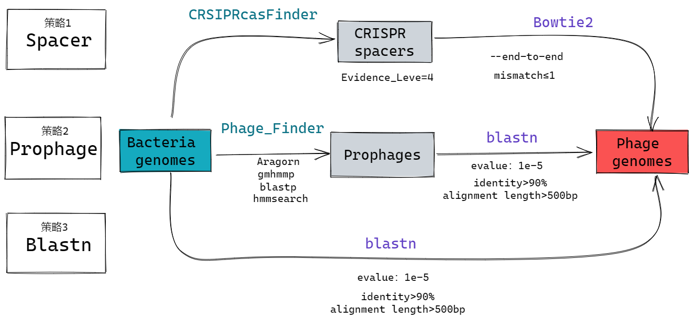

## Systematic identification of intestinal phage-host interactions: Method evaluation and development
> 本科毕设题目：《肠道噬菌体-细菌宿主关系的系统鉴定：
方法评估与开发》

## Timeline
- 2022.02.21~2022.03.03 阅读文献
- 2022.03.04~2022.03.30 完成数据库构建和下载任务！
- 2022.03.23~2022.04.21 NBT文献复现
- 2022.04.25-2022.05.27 毕设内容分析、毕设论文、毕设答辩

## Pipeline

1)	[数据库构建](https://github.com/Achuan-2/phage-host#1-%E6%95%B0%E6%8D%AE%E5%BA%93%E6%9E%84%E5%BB%BA)：根据公开数据集已知的噬菌体侵染宿主范围，构建包括4 295个噬菌体和495个宿主的基准数据集；
2)	[预测PHIs的三种策略](https://github.com/Achuan-2/phage-host#2-%E9%A2%84%E6%B5%8Bphis%E7%9A%84%E4%B8%89%E7%A7%8D%E7%AD%96%E7%95%A5)：对预测噬菌体-宿主菌关系对的三种序列方法进行评估，展示三种方法各自的优缺点；
3)	[从预测的PHIs中预测确定准确的噬菌体宿主范围](https://github.com/Achuan-2/phage-host#3-%E4%BB%8E%E9%A2%84%E6%B5%8B%E7%9A%84phis%E4%B8%AD%E9%A2%84%E6%B5%8B%E7%A1%AE%E5%AE%9A%E5%87%86%E7%A1%AE%E7%9A%84%E5%99%AC%E8%8F%8C%E4%BD%93%E5%AE%BF%E4%B8%BB%E8%8C%83%E5%9B%B4)：探讨在预测的噬菌体-宿主菌关系对中如何更有效的确定可靠的噬菌体宿主范围，比较了基于宿主出现频率的MCH方法和基于比对质量打分的HSH方法，认为HSH更能准确预测噬菌体宿主范围，受数据集中细菌基因组物种分布情况影响较小。

### 1. 数据库构建
数据库筛选

数据库构建与下载

### 2. 预测PHIs的三种策略

### 3. 从预测的PHIs中预测确定准确的噬菌体宿主范围

#### 3.1 MCH方法（Most Common Host）
获取每个病毒所有预测宿主在不同物种分类水平上频数最多的物种名称，将其认为是该病毒最有可能的宿主范围，若该物种名确实在已知病毒报道的真实宿主范围中，则认为预测正确，将该方法命名为MCH（Most Common Host）

【**解释MCH方法**】

【**Purity公式**】

$$
Purity_{r}=\frac{N_{MCH_r}^{v}}{N_{h}^{v}} \\
(r=Phylum, \cdots,Species)
$$

其中，$N_{h}^{v}$代表该噬菌体预测的宿主数量，$N_{MCH_r}^{v}$代表是预测的噬菌体宿主范围在某一物种分类水平下的最高频数，$r$代表的是各个物种分类水平。

### 3.2 HSH方法（Highes Scored Host）

分别对Spacer 方法、Prophage 方法和Blastn 方法预测的PHIs结果根据序列比对质量进行量化打分。PHIs 分数越高则认为越可能是正确的关系对，对于每个噬菌体若有多个PHIs 分数一致，则保留，再使用MCH 的方法为病毒选择最可能的宿主范围，将该方法命名为HSH（Highest Scored Host）。

$$
Score_s =Max(1-\frac{mismatch_i}{spacer\\_length_i})*d \\
$$

$$
Score_p =Max(\frac{alignment_i*identity_i(\\%)}{virus\\_length_i})*d 
$$

$$
Score_b =Max(\frac{alignment_i*identity_i(\\%)}{virus\\_length_i})*d 
$$

$$
d = align\\_num*0.1+1 \\
（i=1,2,\cdots,align\\_num) 
$$

$Score_s$、$Score_p$、$Score_b$代表为Spacer 方法、Prophage 方法和Blastn 方法的打分模型

